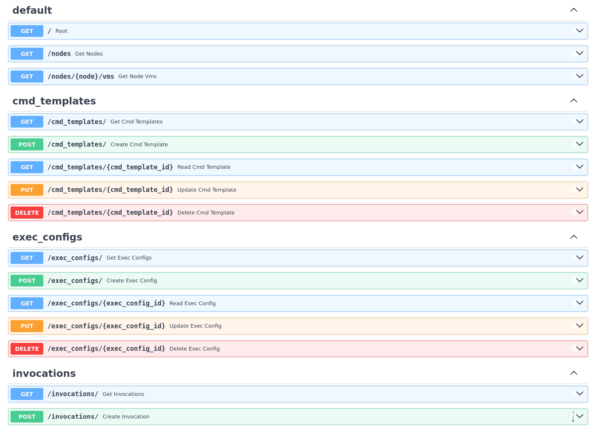

# pve-multiexec

> Renaming note (`pve-drop-guest-caches` -> `pve-multiexec`): Initially created as a way to execute `drop_caches` on a subset of guest VMs to quickly free-up non-essential RAM usage on a PVE node to allow launching Memory-heavy workloads (temporary RAM underprovisioning).
> Then, it was turned into a more generic tool to execute commands on multiple guests and renamed to `pve-multiexec`.

A simple utility that provides a RESTful API for batch execting commands in Proxmox VE quest VMs with `qemu-quest-agent` (e.g., `drop_caches` in non-essential guests).



## Running a Dev Server

```shell
uv run hypercorn pve_multiexec:app --bind 0.0.0.0:8081 --reload
```

## Preliminary Dependencies

* cachetools
* FastAPI
* hypercorn
* Proxmoxer
* pydantic-settings
* python-dotenv
* requests (since it's one of the optional backends for Proxmoxer, we have to add it manually)
* sqlmodel

## Development

### Dev-Dependencies

* httpx
* pytest
* pytest-asyncio

### Testing

```shell
uv run pytest
```

## Next Steps

Just a reminder for myself about the next steps.

Higher priority:

* [x] Implement the invocations endpoint, this is a more generic approach compared to the previous `drop_caches`, single command.
* [ ] Implement aggregate memory consumption info endpoint.
* [ ] Sanitize the list of VMs based on running states of the VMs (not guaranteed to be accurate, because fetching VM states and posting `drop_caches` cannot be done atomically, but allow not sending requests to VMs that are known to be offline or missing).

Lower priority:

* [x] Implement more flexible filtering methods for VM selection.
* [x] Implement custom commands (e.g., view system info). `pve-multiexec` is now more generic.
* [x] Run 2-3 workers, so that `drop_caches` POST requests can be sent in parallel.
* [ ] Rate-limit calls to the upstream server with `cachetools`.
* [ ] Add the CLI script
* [x] Add CLI params to set (done when switched to `pydantic-settings`)
    * [x] the number of workers
    * [x] the usual host and port
    * etc.

Superseded:

* (from high-prio list) ~~Implement the `drop_caches` endpoint (accept a list of VMs).~~
* (from high-prio list) ~~Implement the `drop_caches_tagged` endpoint (accept a non-empty list of tags).~~
